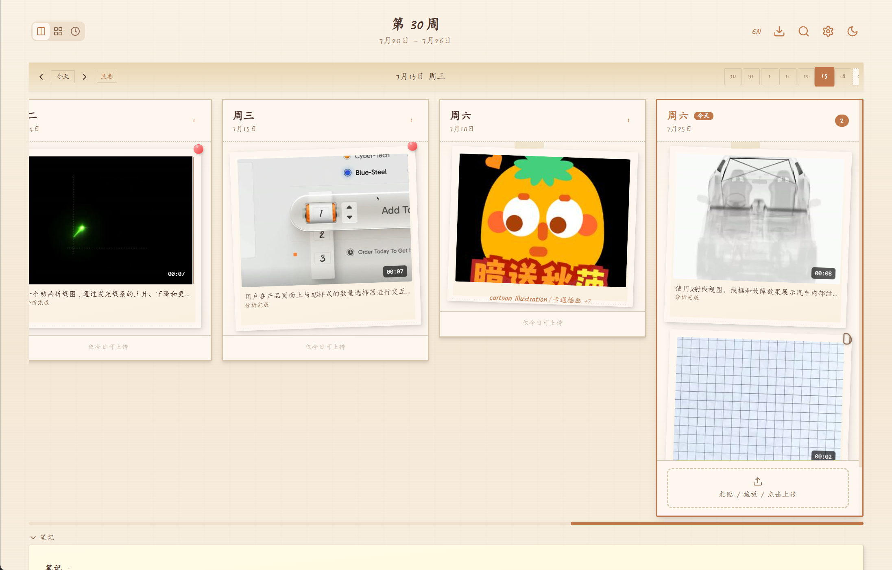
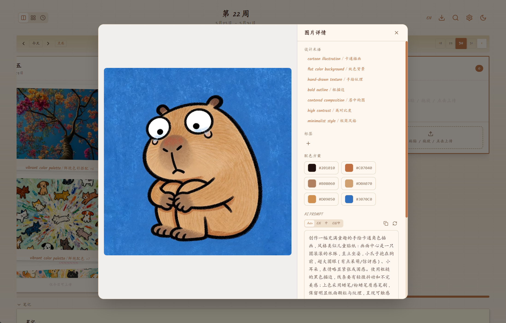
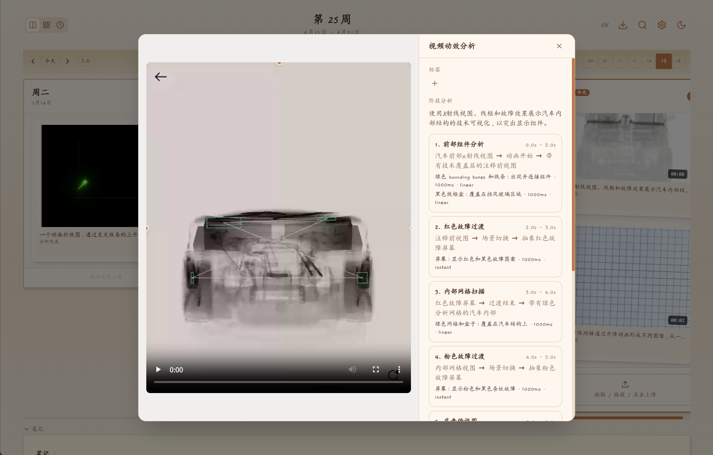
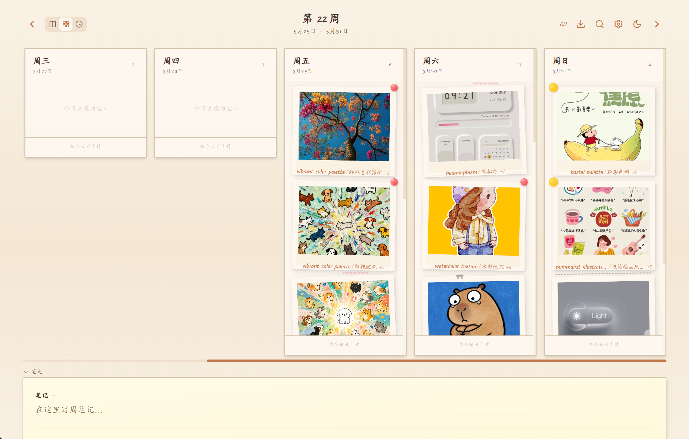
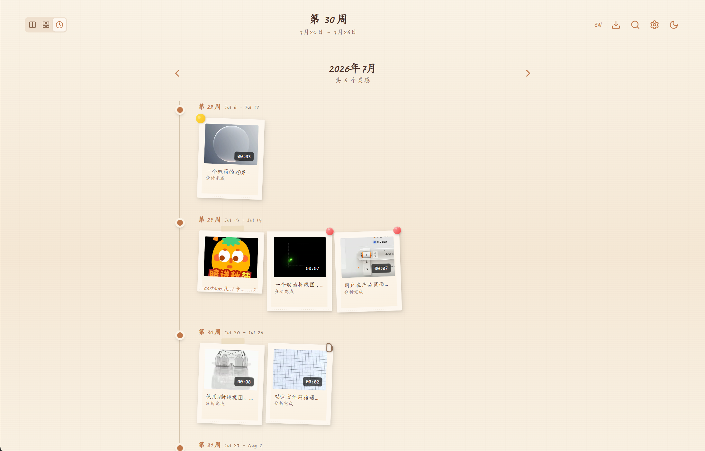

<p align="center">
  
</p>

# InspoClip


**设计师的灵感收纳盒。**

你是不是经常在 Dribbble、Behance、Pinterest 上刷到好看的设计，截图保存后就再也没翻过？InspoClip 就是来解决这个问题的。

**把截图丢进去，AI 帮你整理。** 粘贴一张设计截图，AI 会自动分析出这张图的设计关键词（比如「极简风格」「卡片布局」「大地色系」），帮你建立可搜索的灵感库。下次做设计时，搜一下就能找到之前收藏的相关灵感。

**它能帮你做什么：**

- 📋 **收集** — 粘贴/拖放截图，AI 自动生成设计术语标签
- 🔍 **搜索** — 按关键词找灵感，比如搜「极简」找到所有相关设计
- 🎨 **提取配色** — 自动提取图片主色，一键复制色值
- ✨ **生成 Prompt** — 为设计图生成 AI 提示词，用于 image2/Midjourney/SD 等工具
- 📅 **按时间整理** — 按周/月浏览灵感，回顾自己的审美趋势
- 🚫 **去重** — 上传时自动检测相似图片，避免重复收藏
- 🏷️ **标签分类** — 自定义标签（#UI #插画 #排版），灵活组织灵感
- 📤 **导出** — 支持 ZIP/Markdown/JSON 导出，方便备份或迁移
- 🖥️ **浏览器扩展** — 右键「保存到 InspoClip」，区域截图分析

简单来说：**看到好设计 → 截图 → 粘贴进来 → AI 自动打标签 → 以后随时搜索复用。**

## 功能特性

### 核心功能

- **日视图 / 周视图 / 时间轴视图** — 日视图支持无限横向滚动，时间轴按月回顾灵感
- **AI 术语提取** — 粘贴图片后自动生成 5-10 个中英双语设计术语
- **AI Prompt 生成** — 为设计图片生成可复现风格的 AI 提示词，支持中英切换
- **多模型支持** — Google Gemini / OpenAI 兼容 (DeepSeek, Grok) / Anthropic Claude
- **配色板提取** — 自动提取图片主色（最多 10 色），点击复制 HEX 值
- **图片相似度检测** — 上传时自动检测重复/相似图片，防止重复收集
- **标签/分类系统** — 自定义标签管理，支持按标签筛选搜索
- **智能缩略图** — 基于熵值的智能裁剪，生成高质量缩略图

### 交互体验

- **拼贴风格** — 纸质纹理、和纸胶带、图钉、回形针、订书钉、缝线等 8 种装饰
- **术语交互** — 悬停展开、分中英文独立复制、删除二次确认
- **拖拽排序** — 支持拖拽调整同一天内图片顺序
- **全局粘贴** — 页面任意位置粘贴图片自动上传到今日
- **批量导入** — 支持一次选择/拖入多张图片批量上传
- **键盘快捷键** — `←/→` 切换日期、`/` 搜索、`D/W` 切换视图、`T` 跳转今天、`?` 帮助
- **搜索** — 按术语关键词搜索，支持标签筛选
- **导出** — 支持 ZIP（图片+数据）、Markdown、JSON 三种格式导出
- **中英切换** — 界面一键中英文切换
- **深色模式** — 暖琥珀色深色主题

### 浏览器扩展

- **右键保存** — 在任意网页/图片上右键「Save to InspoClip」
- **区域截图** — 支持框选区域进行分析或保存
- **智能选区** — 悬停自动识别元素区域，点击确认或拖拽自定义
- **分析面板** — 页面内弹出分析结果（术语、色卡、Prompt）
- **历史记录** — 多次分析支持上下翻阅历史
- **相似检测** — 保存前自动检测相似图片并提示确认
- **自定义快捷键** — 支持用户自定义键盘快捷键
- **浮动标签** — 分析后关闭弹窗，右侧显示可拖动的浮动入口

### 插件独立运行模式

插件支持在“后端服务”和“独立运行”之间切换。独立运行模式不依赖本地或远程 InspoClip 服务端，适合个人使用、仅使用浏览器本地资料库和不希望单独部署后端的场景。

- **本地资料库** — 图片、视频、分析结果、Prompt 和任务状态保存在浏览器本地；元数据使用 IndexedDB，大文件使用 OPFS 保存。
- **本地 AI 配置** — 在插件设置中配置模型供应商、接口地址、模型名称和 API Key。当前支持阿里云百炼、OpenAI、OpenRouter 及其他 OpenAI 兼容服务。
- **图片与视频分析** — 独立模式下可直接分析截图、上传图片和录屏视频，并生成设计术语、配色方案、阶段分析和复刻 Prompt。
- **视频抽帧配置** — 对不支持完整视频输入的供应商，可在设置中配置 4–48 帧的抽帧数量；阿里云百炼优先使用免费临时文件上传服务。
- **独立工作台** — 从插件底部打开本地时间轴，支持日视图、周视图、时间轴、搜索、标签、详情查看、Prompt 生成和资源删除。
- **模式数据隔离** — 本地资料库和后端资料库相互独立，切换模式不会自动复制、合并或删除另一模式下的数据。

#### 开启独立模式

1. 点击浏览器工具栏中的 InspoClip 图标，打开插件设置。
2. 将“运行模式”切换为“独立运行”。
3. 在“大模型配置”中选择供应商，填写接口地址、模型名称和 API Key。
4. 返回插件主页，上传或粘贴图片/视频，或使用“分析当前区域”。
5. 通过底部的“打开 InspoClip”进入插件本地工作台。

首次安装插件时默认使用独立运行模式；已有安装会保留当前运行模式。独立模式下 API Key 仅保存在当前浏览器中，插件卸载、浏览器站点数据被清理或存储空间损坏都可能导致本地资料丢失，建议定期导出备份。

## 页面展示

- 主页：
- 图片详情：
- 视频详情：
- 周视图：
- 时间轴视图：
- 插件演示：
- 自定义选区：

## 技术栈

| 层级  | 技术                                                                |
| --- | ----------------------------------------------------------------- |
| 前端  | React 18, TypeScript, Vite, Tailwind CSS, Framer Motion, @dnd-kit |
| 后端  | Node.js, Express, TypeScript, Drizzle ORM, Sharp, LangChain       |
| 数据库 | PostgreSQL 16                                                     |
| AI  | OpenAI SDK (多模型), Sharp (图片处理/色提取/pHash)                          |
| 部署  | Docker Compose, Nginx                                             |
| 扩展  | Chrome Extension Manifest V3                                      |

## 快速开始

### 本地开发

```bash
# 启动 PostgreSQL (Docker)
docker run -d --name inspoclip-postgres \
  -e POSTGRES_USER=inspoclip -e POSTGRES_PASSWORD=inspoclip -e POSTGRES_DB=inspoclip \
  -p 5432:5432 postgres:16-alpine

# 启动后端
cd server
pnpm install
pnpm dev

# 启动前端
cd client
pnpm install
pnpm dev
```

访问 <http://localhost:5173>

### Docker 一键部署

```bash
cp .env.example .env
# 编辑 .env 填入 AI_API_KEY 等配置

docker compose up -d --build
```

访问 <http://localhost:8080>

### 浏览器扩展安装

1. Chrome 打开 `chrome://extensions/`
2. 开启「开发者模式」
3. 点击「加载已解压的扩展程序」
4. 选择项目中的 `extension/` 文件夹

## 环境变量

| 变量                            | 说明                                                             | 默认值                          |
| ----------------------------- | -------------------------------------------------------------- | ---------------------------- |
| `AI_PROVIDER`                 | 模型服务商                                                          | `openai`                     |
| `AI_API_KEY`                  | API 密钥                                                         | `sk-placeholder`             |
| `AI_API_BASE`                 | API 地址                                                         | `https://api.openai.com/v1`  |
| `AI_MODEL`                    | 模型名称                                                           | `gpt-5.4`                    |
| `MODEL_VIDEO_PUBLIC_BASE_URL` | 云端视频模型实际访问的视频公网地址；用于 `/api/model-videos/:id/content` 临时授权链接    | `PUBLIC_BASE_URL`            |
| `MODEL_VIDEO_VERIFY_BASE_URL` | 可选：视频公网地址预检覆盖值；默认留空并跟随 `MODEL_VIDEO_PUBLIC_BASE_URL`，避免只验证内网代理 | 空                            |
| `TUNNEL_MANAGER_URL`          | Docker 内部 tunnel-manager 地址；视频分析预检失败时会调用它刷新 trycloudflare 公网地址 | `http://tunnel-manager:3002` |
| `TUNNEL_TARGET_URL`           | cloudflared 暴露到公网的容器内目标地址                                      | `http://client:80`           |
| `PORT`                        | 前端端口                                                           | `8080`                       |

## 项目结构

```
InspoClip/
├── client/                    # React 前端
│   ├── src/
│   │   ├── components/
│   │   │   ├── DayView.tsx           # 日视图 (无限滚动)
│   │   │   ├── WeekView.tsx          # 周视图 (7列)
│   │   │   ├── TimelineView.tsx      # 时间轴视图 (按月)
│   │   │   ├── DayColumn.tsx         # 日期卡片列 (拖拽排序)
│   │   │   ├── ImageCard.tsx         # 图片卡片 (详情/删除)
│   │   │   ├── ImageUploader.tsx     # 上传组件 (单张/批量)
│   │   │   ├── TermTag.tsx           # 术语标签
│   │   │   ├── TagManager.tsx        # 标签管理器
│   │   │   ├── ColorPalette.tsx      # 配色板组件
│   │   │   ├── DesignPrompt.tsx      # AI Prompt 生成
│   │   │   ├── NotesArea.tsx         # 笔记区域
│   │   │   ├── SearchDialog.tsx      # 搜索弹窗
│   │   │   ├── SettingsDialog.tsx    # AI 设置
│   │   │   ├── ExportDialog.tsx      # 导出弹窗
│   │   │   ├── Toast.tsx             # 通知提示
│   │   │   └── DecorElement.tsx      # 装饰元素
│   │   ├── context/          # ThemeContext, LanguageContext
│   │   ├── hooks/            # useScrollLock, useKeyboardShortcuts
│   │   ├── lib/              # api.ts, utils.ts, events.ts
│   │   ├── i18n/             # translations.ts
│   │   └── types/            # TypeScript 类型定义
│   ├── nginx.conf
│   └── Dockerfile
├── server/                    # Express 后端
│   ├── src/
│   │   ├── routes/
│   │   │   ├── weeks.ts             # 周数据 + 月度时间轴
│   │   │   ├── images.ts            # 图片上传/删除/分析
│   │   │   ├── terms.ts             # 术语管理
│   │   │   ├── tags.ts              # 标签 CRUD
│   │   │   ├── config.ts            # AI 配置
│   │   │   ├── search.ts            # 搜索
│   │   │   └── export.ts            # 导出 (ZIP/MD/JSON)
│   │   ├── services/
│   │   │   ├── ai.ts                # AI 多模型调用
│   │   │   ├── colors.ts            # 配色板提取
│   │   │   ├── phash.ts             # 相似度检测 (pHash+aHash+colorHash)
│   │   │   └── thumbnail.ts         # 智能缩略图生成
│   │   ├── db/               # Drizzle ORM schema + 连接
│   │   └── middleware/       # multer 文件上传
│   └── Dockerfile
├── extension/                 # Chrome 浏览器扩展
│   ├── manifest.json
│   ├── background.js          # Service Worker
│   ├── content.js             # Content Script (页面注入)
│   ├── popup.html/js/css      # 弹出面板
│   └── icons/
├── docker-compose.yml
├── deploy.sh
└── .env.example
```

## API 接口

| 方法       | 路径                               | 说明                     |
| -------- | -------------------------------- | ---------------------- |
| `GET`    | `/api/weeks/:date`               | 获取指定日期所在周的数据           |
| `GET`    | `/api/weeks/month/:YYYY-MM`      | 获取月度时间轴数据              |
| `POST`   | `/api/images`                    | 上传图片 (multipart)       |
| `POST`   | `/api/images/analyze`            | 分析图片 (不保存)             |
| `POST`   | `/api/images/check-similarity`   | 检查相似图片                 |
| `POST`   | `/api/images/:id/prompt`         | 生成/获取 AI Prompt        |
| `POST`   | `/api/images/:id/critique`       | 生成/获取 AI 点评            |
| `PATCH`  | `/api/images/reorder`            | 更新图片排序                 |
| `DELETE` | `/api/images/:id`                | 删除图片及术语                |
| `DELETE` | `/api/terms/:id`                 | 删除单个术语                 |
| `PATCH`  | `/api/weeks/:id/notes`           | 保存笔记                   |
| `GET`    | `/api/tags`                      | 获取所有标签                 |
| `POST`   | `/api/tags`                      | 创建标签                   |
| `DELETE` | `/api/tags/:id`                  | 删除标签                   |
| `POST`   | `/api/tags/image/:id`            | 给图片添加标签                |
| `DELETE` | `/api/tags/image/:id/:tagId`     | 移除图片标签                 |
| `GET`    | `/api/search?q=keyword`          | 搜索术语                   |
| `GET`    | `/api/export/week/:date?format=` | 导出 (zip/markdown/json) |
| `GET`    | `/api/config`                    | 获取 AI 配置               |
| `PATCH`  | `/api/config`                    | 更新 AI 配置               |
| `GET`    | `/api/health`                    | 健康检查                   |

## TODO：插件独立运行模式

目标：让浏览器扩展在同一套 UI 中自由切换后端服务模式和独立运行模式。当前独立模式的本地资料库、AI 分析和插件工作台已经可用，以下清单记录已完成能力和后续规划。

### 运行与数据规则

- [x] 在插件设置中提供“独立运行”和“后端服务”两种模式，并清晰展示当前模式、连接状态和存储占用。
- [x] 首次安装插件时默认使用独立运行模式；切换模式不应丢失当前模式下的数据。
- [x] 本地资料库与后端资料库默认相互隔离，不在模式切换时自动复制或合并数据。
- [ ] 提供显式的数据迁移入口，支持“本地迁移到后端”和“后端迁移到本地”，迁移前展示数量、冲突和预计占用空间。
- [x] 后端临时不可用时不静默切换数据源，避免用户误以为资料丢失。
- [ ] 增加后端离线待同步队列。

### 实施路线

- [x] 抽象 `ExtensionRuntime`、`AssetRepository`、`AnalysisAdapter` 和 `BlobStore` 等统一接口，逐步解除界面层对 `/api` 及 `serverUrl` 的直接依赖。
- [x] 保留现有后端适配器并补充回归测试，确保后端模式的上传、分析、保存、搜索和导出流程不受影响。
- [x] 实现本地存储适配器：使用 IndexedDB 保存元数据、分析结果和任务状态，使用 OPFS 保存图片、视频等大文件，使用 `chrome.storage.local` 保存模式、模型和界面设置。
- [x] 区分临时分析记录与已保存灵感：草稿和会话记录可在弹窗关闭后恢复，只有用户主动保存后才进入本地资料库。
- [x] 增加插件内本地工作台，覆盖日视图、周视图、时间轴、搜索、详情、标签、Prompt、删除和 JSON 导出。
- [x] 支持用户自带 API Key（BYOK），已接入阿里云百炼、OpenAI、OpenRouter 和其他 OpenAI 兼容服务。
- [x] 将视频分析改造成可恢复的持久化任务，支持 Popup 关闭后继续执行并恢复任务状态。
- [ ] 实现本地与后端之间的迁移服务，包括去重、冲突处理、失败重试、迁移报告和可中止操作。
- [x] 在文档中增加独立模式的安全提示，明确浏览器扩展卸载或站点数据被清理可能导致本地资料丢失。
- [ ] 在插件内增加备份导入/导出、恢复和存储清理功能。
- [ ] 预留可选的 `SyncProvider` 扩展点，未来可接入用户自有 WebDAV、S3 兼容存储或其他同步服务，但不作为独立运行模式的前置依赖。

## License

MIT

## 视频动效分析

InspoClip 支持上传 10 秒至 2 分钟、最大 200 MB 的 MP4、MOV 或 WebM 产品/UI 动效演示。服务端异步调用视频理解模型，输出完整时间线、界面状态变化和可复刻动作，并按用途生成通用提示词、视频生成提示词、前端实现规格、AE/Figma 动效规格、分镜或 JSON。

默认视频模型为 `qwen3.7-plus`，可在设置页独立修改视频 API 地址、密钥、模型和 1–5 FPS 采样率。部署时必须将 `PUBLIC_BASE_URL` 设置为云模型可访问的 HTTPS 地址；模型会从 `${PUBLIC_BASE_URL}/api/videos/:id/content` 读取待分析视频，`localhost` 仅适用于能够访问本机的模型代理。

视频任务状态为 `pending`、`processing`、`completed` 或 `failed`。服务重启后会恢复中断任务，限流和瞬时网络错误最多重试三次。视频和封面保存在独立 Docker volume `videos` 中。
